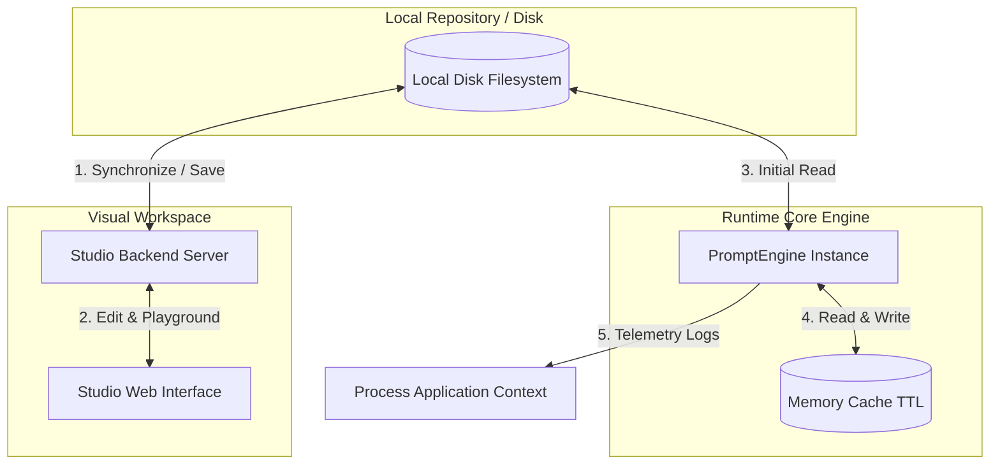

# Git-Backed Prompt Engine

A secure, decoupled prompt management and visual engineering workspace. The **Git-Backed Prompt Engine** bridges the gap between collaborative prompt design and production application engineering. It provides a lightweight, local runtime core library alongside a visual, git-integrated desktop Studio UI.

For the full domain context and design philosophy, refer to [Git_Backed_Prompt_Engine_Domain_Context.md](file:///Users/glumac/coding/git-prompt-engine/Git_Backed_Prompt_Engine_Domain_Context.md).

---

## 1. Core Architecture

The Git-Backed Prompt Engine is designed as a **decoupled architecture**:

1. **Lightweight Runtime Core Engine (`@git-prompt-engine/core`):** A zero-dependency, ultra-lightweight TypeScript library executing entirely in-process. It loads JSON or YAML prompt templates from your local codebase, caches them with configurable expiration cycles (TTL), validates schemas using Zod, and resolves placeholders securely without any network overhead or latency.
2. **Visual Desktop Studio Workspace (`@git-prompt-engine/studio`):** A locally spawned visual environment featuring an interactive WYSIWYG editor, playground execution, LLM response streaming, structural validation diagnostics, and native Git integration. It commits template updates directly back to your local repository branch.

### Architectural Flow



### Core Value Proposition

* **Zero Production Runtime Risk:** The engine runs completely in-process within your application, requiring no external HTTP/gRPC roundtrips to fetch templates. There are no external service degradation dependencies or subscription SaaS billing bottlenecks.
* **Strict Enterprise-Grade Privacy:** Prompt templates are saved as static configuration files. No prompt contents, inputs, variables, or system logs ever leave your secure environment.
* **Git Version Control Single Source of Truth:** Prompts are tracked like code. Versioning, rollbacks, branching, and PR code reviews leverage your standard Git repository workflow.

---

## 2. Core Library Integration Guide

The core runtime engine handles loading, parsing, validating, caching, and compiling templates.

### Installation

Install the package via npm inside your project:

```bash
npm install @git-prompt-engine/core
```

### Configuration Options

When instantiating the [PromptEngine](file:///Users/glumac/coding/git-prompt-engine/packages/core/src/index.ts#L13), you specify an object of type [EngineOptions](file:///Users/glumac/coding/git-prompt-engine/packages/core/src/types/index.ts#L32):

| Option | Type | Required | Description |
| :--- | :--- | :---: | :--- |
| `promptDir` | `string` | Yes | The absolute path to the directory containing JSON or YAML prompt templates. |
| `cacheTtl` | `number` | No | In-memory cache validity in milliseconds. Prevents redundant disk reads. |
| `fallbackParams` | `Record<string, string>` | No | Default global variables to inject if they are omitted in runtime payloads. |
| `onTelemetry` | `(event: TelemetryEvent) => void` | No | Callback triggered during lifecycle events (reads, cache hits/misses, compiles, schema checks). |

---

### Complete TypeScript Integration Example

The following code illustrates loading the engine, resolving template variables, using fallback parameters, configuring telemetry, and handling common runtime exceptions:

```typescript
import * as path from 'path';
import { PromptEngine, TelemetryEvent, MessageTemplate } from '@git-prompt-engine/core';

// 1. Configure Engine Options
const engine = new PromptEngine({
  // Absolute path to prompts directory
  promptDir: path.resolve(__dirname, '../../prompts'),
  
  // Cache parsed templates in memory for 1 minute
  cacheTtl: 60000, 
  
  // Global fallback arguments (injected if missing from invocation payload)
  fallbackParams: {
    systemTone: 'professional and clear',
    companyName: 'Acme Corp',
  },
  
  // Register telemetry handlers to feed application logs or APM services
  onTelemetry: (event: TelemetryEvent) => {
    const { type, promptId, durationMs, success, error } = event;
    console.log(`[Telemetry] [${type}] Prompt: ${promptId} | Duration: ${durationMs.toFixed(2)}ms | Success: ${success}`);
    if (!success && error) {
      console.error(`[Telemetry] [Error Details] ${error}`);
    }
  }
});

/**
 * Executes prompt variable compilation and system message rendering safely.
 */
async function generatePrompt(promptId: string, variables: Record<string, string>) {
  try {
    // Compile resolves and interpolates variables inside prompt-id.json or prompt-id.yaml templates
    // Alternately, engine.render(...) can be used (it acts as an alias to compile)
    const compiledMessages: MessageTemplate[] = await engine.compile(promptId, variables);
    
    console.log(`Successfully compiled prompt: "${promptId}"`);
    return compiledMessages;
  } catch (error: any) {
    // 2. Exception & Fault Handling
    if (error.message.includes('Evaluation Error')) {
      // Occurs if a required variable declared in the template is missing in variables & fallbackParams
      console.error(`[Validation Failed] Missing required variables: ${error.message}`);
    } else if (error.message.includes('Security Error')) {
      // Occurs if path traversal or access outside the prompt directory is detected
      console.error(`[Security Violation] Path traversal blocked: ${error.message}`);
    } else {
      // Generic failures (e.g. invalid JSON syntax, ENOENT disk error)
      console.error(`[Runtime Engine Failure] Failed to load/parse template: ${error.message}`);
    }
    throw error;
  }
}

// Example Execution
(async () => {
  // Supposing translator.json exists with requiredVariable: ["textToTranslate"]
  const messages = await generatePrompt('translator', {
    textToTranslate: 'Hello world, welcome to our platform!',
    // 'systemTone' and 'companyName' are filled automatically by fallbackParams
  });
  console.log('Resulting Messages:', messages);
})();
```

---

## 3. Visual Studio Workspace Guide

The Studio provides an intuitive, web-based workspace allowing product managers, domain experts, and engineers to collaborate directly on prompt files.

### Development Mode

To start both the client and server locally in concurrent development watch mode, run the following command from the workspace root:

```bash
npm run studio:dev
```

This boots:
* **Studio Client UI:** Vite development server running on `http://localhost:5173`.
* **Studio Server API:** Express-based server running on `http://localhost:3000`.

### Production CLI Execution

To run the production-compiled version, build the packages first, and then run the CLI entry point pointing it to your prompt directory:

```bash
# 1. Compile all packages (Core + Studio Server/Client)
npm run studio

# 2. Run the CLI wrapper pointing to your prompts folder
node packages/studio/server/dist/index.js --dir ./prompts --open
```

#### Available CLI Command Flags

* `--dir`, `-d` *(Required)*: Absolute or relative path to the prompt templates directory.
* `--port`, `-p` *(Default: 3000)*: Port on which the Studio local server listens.
* `--open`, `-o` *(Boolean)*: Automatically launch the Studio UI in the default system web browser.

---

### Core Studio Features

* **Visual WYSIWYG Editor:** Safely edit roles (system, user, assistant), prompt system prompts, and message blocks without corrupting syntax.
* **Local Variable Playground:** Renders interactive form inputs dynamically based on the parsed variables within each prompt template.
* **SSE LLM Streaming Completes:** Connects to LLM APIs (OpenAI, Gemini, Anthropic) directly from the browser context to test prompt variations. Response logs stream back via Server-Sent Events (SSE).
  > [!NOTE]
  > API keys are stored locally in the browser's `localStorage` and sent in headers directly to the local server, ensuring credentials never leave your workspace.
* **Visual Diff Modal:** Inspect clean, color-coded diff modifications before saving changes back to your local filesystem.
* **Native Git Operations:**
  * **Branch Controls:** Toggle between local branches, checkout existing branches, or spin up new prompt engineering sandboxes.
  * **Commit Operations:** Run atomic staged commits on updated prompt templates with descriptive automated message signatures.
  * **Push to Origin:** Publish prompt updates to GitHub, GitLab, or Bitbucket directly from the UI, initiating standard code-review workflows.
* **Live Telemetry & Metrics:** Interactive charts display compile durations, validation success rates, cache hit/miss distributions, and recent operation logs.

---

## 4. Monorepo Project Structure

The project operates as a standard npm monorepo workspace.

```
git-prompt-engine/
├── Git_Backed_Prompt_Engine_Domain_Context.md   # System requirements & specifications
├── package.json                                 # Root workspace configuration
├── prompts/                                     # Dedicated repository directory for templates
│   ├── translator.json                          # Sample translation prompt template
│   └── testing-this-shit.json
└── packages/
    ├── core/                                    # Process Runtime Dependency
    │   ├── src/
    │   │   ├── index.ts                         # Core Engine source implementation
    │   │   └── types/
    │   │       └── index.ts                     # Zod prompt schemas & TS declarations
    │   └── package.json
    └── studio/                                  # Local Visual Workspace
        ├── client/                              # Vite & Tailwind CSS SPA Client
        │   └── package.json
        └── server/                              # Node & Express CLI Server
            ├── src/
            │   ├── index.ts                     # Server CLI runner and arguments parser
            │   ├── server.ts                    # Express routing and controller registration
            │   └── services/
            │       └── git.service.ts           # Git branch checkout, commit, push services
            └── package.json
```

### Quick Code Reference Links

* [Engine Core Source File](file:///Users/glumac/coding/git-prompt-engine/packages/core/src/index.ts)
* [Engine Core Type Definitions](file:///Users/glumac/coding/git-prompt-engine/packages/core/src/types/index.ts)
* [Studio Server Main CLI Wrapper](file:///Users/glumac/coding/git-prompt-engine/packages/studio/server/src/index.ts)
* [Studio Server Server Bootstrap](file:///Users/glumac/coding/git-prompt-engine/packages/studio/server/src/server.ts)
* [Studio Git Service](file:///Users/glumac/coding/git-prompt-engine/packages/studio/server/src/services/git.service.ts)

---

## License

This project is proprietary utility software. All rights reserved.
